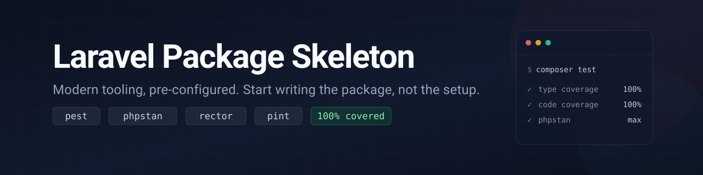

<p align="center">
  
</p>

<p align="center">
  <a href="https://github.com/marekmiklusek/laravel-package-skeleton/actions"></a>
  <a href="https://packagist.org/packages/marekmiklusek/laravel-package-skeleton"></a>
  <a href="https://packagist.org/packages/marekmiklusek/laravel-package-skeleton"></a>
  <a href="https://github.com/marekmiklusek/laravel-package-skeleton/blob/main/LICENSE.md"></a>
</p>

🏗️ **Modern Laravel package skeleton with development tools pre-configured.**

A starting point for building Laravel packages, with testing, static analysis, refactoring and code style already wired up and enforced in CI.

## Features

- 🧪 **Pest 5** with Testbench, arch tests and parallel execution
- 📦 **`illuminate/support` only**, so the skeleton does not force a framework version on consumers
- 📊 **100% code coverage** and **100% type coverage** enforced
- 🔍 **PHPStan (Larastan)** at level `max` over `src` and `tests`
- 🔧 **Rector** automated refactoring and PHP version upgrades
- 🎨 **Laravel Pint** code formatting
- 🚀 **GitHub Actions** tests across PHP 8.4 / 8.5 and lowest / highest dependencies
- 🤖 **Dependabot** for Composer and GitHub Actions updates

## Requirements

- PHP 8.4+
- Laravel 13+

## Installation

Create a new Laravel package from this skeleton:

```bash
composer create-project marekmiklusek/laravel-package-skeleton MyAwesomePackage
```

This creates a `MyAwesomePackage` directory with all skeleton files. Then rename
the namespace, the service provider and the package name in `composer.json` to
match your package.

## Usage

| Command | What it does |
| --- | --- |
| `composer test` | Run every quality gate the CI pipeline runs |
| `composer test:unit` | Run the test suite with exactly 100% code coverage |
| `composer test:type-coverage` | Require 100% type coverage |
| `composer test:types` | Run Larastan static analysis |
| `composer test:lint` | Check code style and pending refactorings without writing files |
| `composer lint` | Apply Rector refactorings and fix code style |

Run `composer test` before pushing. It mirrors CI exactly.

## What's Included

| Path | Purpose |
| --- | --- |
| `src/` | Your package source code |
| `src/PackageSkeletonServiceProvider.php` | The package service provider |
| `tests/TestCase.php` | Testbench base test case registering the provider |
| `tests/Pest.php` | Pest configuration binding Testbench to `Feature` only |
| `tests/ArchTest.php` | Architecture rules (strict types, no debug calls) |
| `tests/Feature/` | Feature tests booting a real Laravel application via Testbench |
| `tests/Unit/` | Unit tests running without a framework instance |
| `phpstan.neon` | Static analysis configuration |
| `rector.php` | Refactoring rules |
| `pint.json` | Code style configuration |
| `phpunit.xml` | Test runner and coverage source configuration |
| `.github/workflows/tests.yml` | GitHub Actions test pipeline |
| `.github/dependabot.yml` | Dependency update automation |

## Dependencies

The package itself only requires `illuminate/support`, not the full framework.
Add further `illuminate/*` components to `require` as your package needs them,
and keep `orchestra/testbench` in `require-dev` for testing against a real
Laravel application.

## Changelog

See [CHANGELOG.md](CHANGELOG.md).

## License

The MIT License (MIT). See [LICENSE.md](LICENSE.md).
